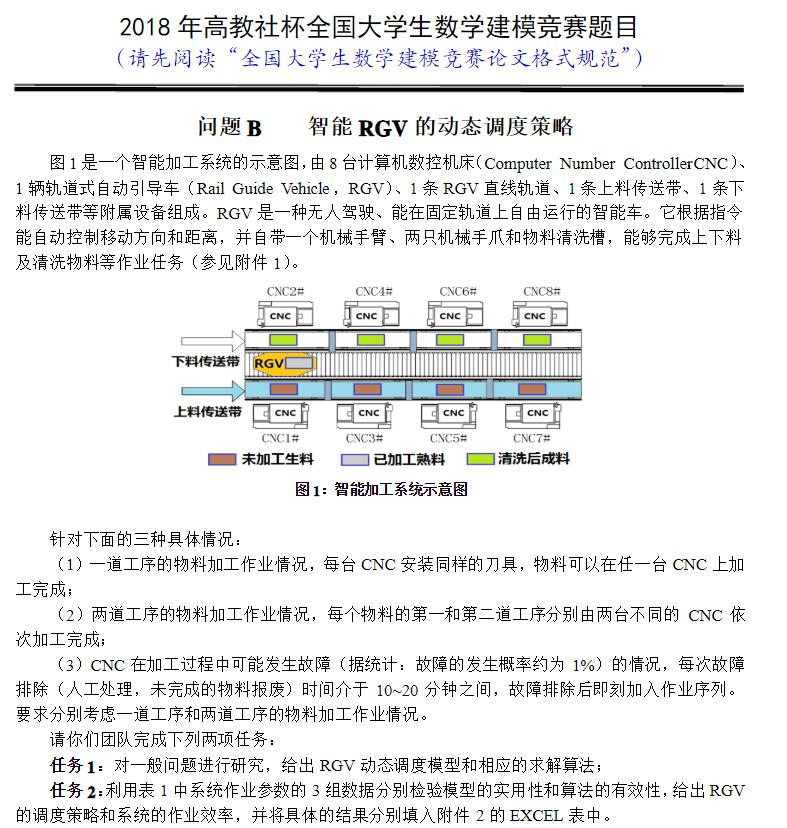

### 2018年数模国赛B题参考程序

​	有幸在这次数模国赛里获得了二等奖(虽然对不保研的我没啥用)，感觉还是有运气的原因，毕竟大多数人选择了难度低一些的A题。

​	虽然程序写的还是比较粗糙，但是我觉得思路还算正确，故发上来备份一下。

​	在这个方案中，我使用了三个类 --- RGV、CNC、Package，分别模拟题中的三个部分 --- 运输车、加工车床、物料。然后通过其成员方法模拟这三个部分的行为。

​	然后对不同的情况用不同的参数进行初始化，对需要随机产生故障的情况用随机数产生故障。

​	在寻找最优解时，使用爬山法，迭代10万次，找出其中的极优解，并将其认为最优解。

​	因为在数学建模中需要考虑现实情况，现实中，这个极优解已经和理论最优解非常接近。而使用更加复杂的方法去获取最优解，对整个系统的效率并没有太大的提升。

​	所幸，出题者的想法应该是和我一样的，哈哈。

##### 注：程序为idea工程，结构较乱，运行前请先阅读代码并选择性取消其中的部分代码的注释。

### 2018国赛B题题目

